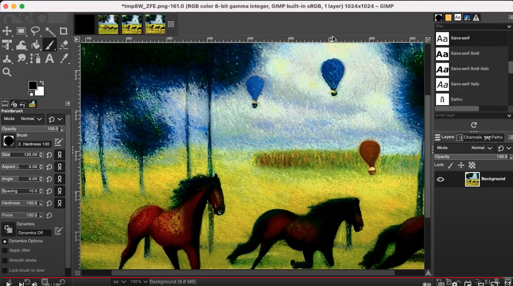

<a name="readme-top"></a>

<div>
<h1 align="center">Stable Boy</h1>
  <p align="center">
    A GIMP plugin for AUTOMATIC1111's Stable Diffusion WebUI
  </p>
</div>

<!-- ABOUT THE PROJECT -->
## About

[AUTOMATIC1111's Stable Diffusion WebUI](https://github.com/AUTOMATIC1111/stable-diffusion-webui) is one of the most powerful tools in the generative AI space. Stable Boy puts that power into GIMP 2.10 by calling into A1111 WebUI's API.

Here's a short demo video:

[](https://youtu.be/YMVog30OcTI)

(Not shown: 🆕 Using rectangular selections to select the region that Stable Diffusion will process. See Usage below.)

<p align="right">(<a href="#readme-top">back to top</a>)</p>


## Installation

1. Clone the repo:
   ```sh
   git clone https://github.com/tgiesselmann/gimp-stable-boy.git
   ```
1. Start GIMP, open Preferences and add the absolute path to _sub-folder_ (!) `src/gimp_stable_boy` to GIMP's plugin search path:
   ```
   /home/...and-so-on.../gimp-stable-boy/src/gimp_stable_boy     # MacOS, Linux
   C:/Users/...and-so-on.../gimp-stable-boy/src/gimp_stable_boy  # Windows
   ```
   
1. Restart GIMP and create a new file with a reasonable size, like `512x512`.
1. Stable Boy can be found in the `Stable Boy` top menu, with the following options:
   1. Text to Image
   2. Image to Image
   3. Inpainting
   4. Extras (for upscaling)
1. Start A1111 WebUI with argument `--api`. It doesn't matter whether it's running on your local machine or somewhere in the cloud.
1. Copy-paste A1111 WebUI's URL (something like `https://abcdef123.gradio.com`) into the `API URL` field. (For the time being you'll have to do that once for every generation option.)


<p align="right">(<a href="#readme-top">back to top</a>)</p>


<!-- USAGE EXAMPLES -->
## Usage

### Image size

The minimum resolution is 512x512.

### Generate images or layers

Stable Boy can open the results coming from Stable Diffusion either as new images or as new layers in the current image. Using layers is very powerful, especially when inpainting large images.

### 🆕 Support for Rectangle Selection tool

Use rectangular selections for selecting the region that Stable Diffusion will process. This makes it possible to work with images of arbitrary size. Note that **the selection's width and height need to be multiples of 8**. Think `512x512`, `512x768`, `1024x768`, that kinda thing.

> 👉 Using GIMP's fixed-size rectangular selections makes this easy.

When there is no selection, Stable Boy will process the full image. (Therefore image sizes should also be multiples of 8.)

> ❗️ Make sure your selected region is completely within the image.

### Inpainting

Add a layer named `Inpainting Mask` to the image (see video) and make it the top layer. Use a paintbrush and paint the region you want to inpaint with black on that mask layer. Stable Boy will automatically determine the area of the image to process.

Stable Boy will insert any generated layers under the inpainting mask layer and hide the mask layer. The mask itself remains as is.

> 👉 Select the mask layer and hit `DEL` to clear the mask.

### Model selection

Stable Boy does not have an option to choose the model. You'll have to do that in WebUI. Loading an inpainting model in A1111's WebUI is also recommended.

<p align="right">(<a href="#readme-top">back to top</a>)</p>


<!-- ROADMAP -->
## Roadmap

✅ ~~Rectangular selections as image sources for each mode~~

✅ ~~Inpainting on large images: Stable Boy determines the region to send to Stable Diffusion based on where you painted the mask~~

- [ ] Outpainting
- [ ] Better GUI
- [ ] Keep metadata (seed, sampler settings and such)
- [ ] Support for more options
- [ ] Better documentation

See the [open issues](https://github.com/tgiesselmann/gimp-stable-boy/issues) for known issues.

<p align="right">(<a href="#readme-top">back to top</a>)</p>


<!-- CONTRIBUTING -->
## Contributing

Contributions are what make the open source community such an amazing place to learn, inspire, and create. Any contributions you make are **greatly appreciated**. If you have a suggestion that would make this better, please fork the repo and create a pull request. Thank you!

1. Fork the project
2. Create your feature branch (`git checkout -b feature/amazing-feature`)
3. Commit your changes (`git commit -m 'Adding some amazing feature'`)
4. Push to the branch (`git push origin feature/amazing-feature`)
5. Open a pull request

<p align="right">(<a href="#readme-top">back to top</a>)</p>


<!-- LICENSE -->
## License

Distributed under the GNU General Public License v3.0. See file [`COPYING`](COPYING) for more information.

<p align="right">(<a href="#readme-top">back to top</a>)</p>


<!-- CONTACT -->
## Contact

Torben: tsgiesselmann@gmail.com

Stable Boy: [https://github.com/tgiesselmann/gimp-stable-boy](https://github.com/tgiesselmann/gimp-stable-boy)

<p align="right">(<a href="#readme-top">back to top</a>)</p>


<!-- ACKNOWLEDGMENTS -->
## Acknowledgments

In the end, everyone stands on the shoulders of giants.

* [Stable Diffusion](https://github.com/CompVis/stable-diffusion)
* [AUTOMATIC1111](https://github.com/AUTOMATIC1111/stable-diffusion-webui)
* [GIMP](https://www.gimp.org/)
* [blueturtleai's gimp-stable-diffusion](https://github.com/blueturtleai/gimp-stable-diffusion)
* [Stack Overflow](https://stackoverflow.com/)
* [Daniel Alcalde Puente](https://github.com/danielalcalde)
* [Othneil Drew](https://github.com/othneildrew)

<p align="right">(<a href="#readme-top">back to top</a>)</p>
